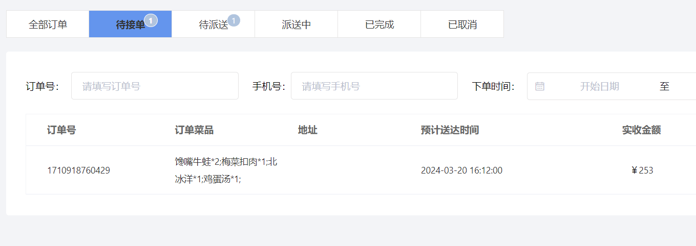

# take-out-web

以Vue+ElementUI为前端框架，Springboot为后端框架的外卖系统

## 功能

前端页面分为工作台，数据统计，订单管理，套餐管理，菜品管理，分类管理，员工管理几个板块。  
后端负责从数据库查询数据返回给前端，同时支持其他增删改的功能。  
用户可以使用它来查看订单情况，管理订单，菜品，和员工等数据。

  
  
  
  

## 技术栈

前端：vue+elementUI  
后端：springboot  
数据库：mysql，redis，mybatis  
前后端通信：restfulAPI 
库：lombok，jsonwebtoken等

## 如何运行

后端(sky-take-out)：  
安装java运行环境，等待编译器下好maven依赖资源  
配置application-env.yml  
前端(project-sky-admin-vue-ts)：  
运行npm run serve，版本为16或15

## 碎碎念

详情可见[学习笔记](项目memo.docx)

## 问题和反馈

如果你遇到问题或有任何建议，请在 [GitHub Issues] 中提出。

## 许可证

这个项目采用 [Apache-2.0 license](LICENSE)。

